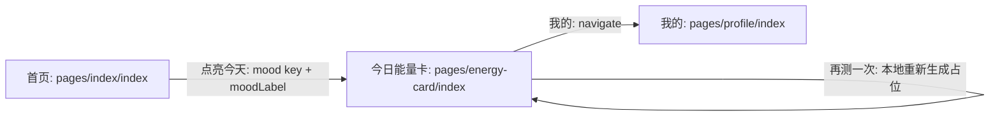

# 今日能量卡页面实现计划

## 需求落点

- 首页 `点亮今天`：在用户选中“今日心情”后点击，跳转到“今日能量卡片页面”（对应你给的第二张图样式）
- 卡片页：标题展示用户选择的心情文案（开心/平静/焦虑/疲惫）

## 前置现状（当前代码）

- 首页：`[/Library/WebServer/web_www/yake/pages/index/index.vue](https://example.com)`（当前已具备“今日心情”选择与 `hasCheckedIn` 本地状态）
- 自定义底部 tabbar：`[/Library/WebServer/web_www/yake/components/custom-tabbar/custom-tabbar.vue](https://example.com)`
- 路由配置：`[/Library/WebServer/web_www/yake/pages.json](https://example.com)`（目前仅包含 index/analyze/records/profile）

## 实施步骤

1. 增加能量卡片页面路由

- 在 `[/Library/WebServer/web_www/yake/pages.json](https://example.com)` 新增一项：
  - `path`: `pages/energy-card/index`
  - `style.navigationStyle`: `custom`（让我们用页面自绘顶部返回按钮）

1. 创建能量卡片页面（UI + 本地占位逻辑）

- 新建文件：`[/Library/WebServer/web_www/yake/pages/energy-card/index.vue](https://example.com)`
- 功能点：
  - `onLoad(options)` 读取首页传参：`mood`（key）和 `moodLabel`（开心/平静/焦虑/疲惫）
  - 页面顶部区域：
    - 左侧返回按钮：`uni.navigateBack()`
    - 标题区：小标题（可用“今日关键词”）+ 大标题显示 `moodLabel`
  - 卡片主体（本地映射占位）：根据 `mood` 生成 `今日建议` 与 `能量卡片` 文案（先固定一套映射，后续可替换为真实 AI 输出）
  - 底部操作栏（对应截图）：
    - `分享`：先 `uni.showToast({title:'已加入分享队列/占位'})`
    - `再测一次`：在同一心情下重新生成占位文案（可用随机/序号），并 toast
    - `我的`：跳到 [`/pages/profile/index`] 作为占位
  - 页面底部不要复用自定义 tabbar（截图底部样式不同）

1. 修改首页“点亮今天”点击逻辑以跳转卡片页

- 在 `[/Library/WebServer/web_www/yake/pages/index/index.vue](https://example.com)` 中：
  - 计算 `selectedMoodLabel`（从 `moodOptions` 根据 `selectedMood` 反查 label）
  - `handleLightToday()` 在首次点亮时仍保留：
    - 更新 `hasCheckedIn` 与 `streakDays`
    - toast 成功反馈
  - 然后无论首次与否（建议：首次成功后跳转；重复点亮给提示不重复跳转），执行：
    - `uni.navigateTo({ url: '/pages/energy-card/index?mood=...&moodLabel=...' })`

1. 校验

- 检查：
  - 选择不同“今日心情”后，大标题正确展示对应文案
  - 点击“点亮今天”能正确跳转并返回
  - 底部三按钮交互不报错

## 数据流简图

