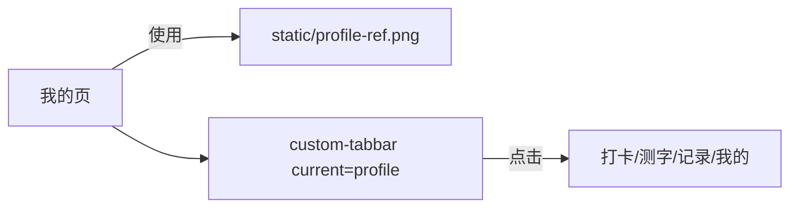

# 我的页面完全复刻（含底部 tabbar）

## 目标

- 页面文件：`[/Library/WebServer/web_www/yake/pages/profile/index.vue](pages/profile/index.vue)` 生成与截图一致的“我的”个人中心 UI（静态 mock 文案与交互开关占位）。
- 底部导航：`[/Library/WebServer/web_www/yake/components/custom-tabbar/custom-tabbar.vue](components/custom-tabbar/custom-tabbar.vue)` 改成与截图一致的图标风格与选中态（“我的”高亮）。
- 头像：由于项目内没有单独头像资源，你选择“用截图做背景裁剪定位头像”，因此会把参考图拷贝到 `static/`，用 CSS 背景定位实现头像照片显示。

## 关键资源

- 拷贝参考图到项目静态目录：
  - 将 `[/Users/zhuangyb/.cursor/projects/Library-WebServer-web-www-yake/assets/image-a381a432-ea1b-4a68-9ae0-a1634919d9f6.png](assets/image-a381a432-ea1b-4a68-9ae0-a1634919d9f6.png)` 复制为 `[/Library/WebServer/web_www/yake/static/profile-ref.png](static/profile-ref.png)`
- 用 `windowWidth` 动态计算背景缩放与裁剪偏移，保证头像在不同宽度下仍尽量对齐参考图。

## 实施步骤

### 1. 重写“我的”页面结构

- 更新：`[/Library/WebServer/web_www/yake/pages/profile/index.vue](pages/profile/index.vue)`
- 用 Options API 与现有页面一致。
- 页面主体结构建议（按截图从上到下）：
  - 顶部用户区：头像（裁剪自 `profile-ref.png`）+ 姓名“林知夏”+ 加入时间“已加入 2026-02-10”。
  - 三宫格数据卡行：
    - “连续打卡 5 天”（带蓝色圆形图标与数字 5）
    - “总打卡数 18 次”（带蓝色勾选圆形图标与数字 18）
    - “能量值 1280 点”（带蓝色闪电图标与数字 1280）
  - 两个大按钮行（描边卡片）：
    - “我的记录”（左侧循环/回转图标）
    - “返回首页”（左侧房子图标）
  - “AI人格偏好”区：标题左侧 + 右侧当前项“温柔”，下方一句固定描述。
  - 会员卡：
    - 标题“基础版”+ 左侧皇冠图标底座
    - 主按钮“升级会员”（蓝色圆角大按钮）
  - 消息通知卡：
    - 标题“消息通知”+ 左侧铃铛图标
    - 文案“按每天打卡提醒”
    - 右侧开关（默认关闭占位）
  - 列表项：两行
    - “关于打卡有光”（左侧小图标，右侧箭头）
    - “帮助与反馈”（左侧问号/信息图标，右侧箭头）
  - 页底使用现有 `custom-tabbar current="profile"`，并在页面容器上留出底部安全区 padding，避免内容遮挡。

### 2. 底部 tabbar 改成截图一致的选中态与图标

- 更新：`[/Library/WebServer/web_www/yake/components/custom-tabbar/custom-tabbar.vue](components/custom-tabbar/custom-tabbar.vue)`
- 保持 4 个入口 key 不变（`checkin/analyze/records/profile`）。
- 替换当前 unicode 图标，改为内联 SVG（`stroke/fill` 通过 `currentColor` 控制），并通过 CSS 实现：
  - 未选中：图标与文字为更低对比度灰蓝
  - 已选中：图标与文字为高亮蓝
- 调整 tabbar 高度、间距、文字大小，贴近截图底部样式。

### 3. 头像裁剪实现（使用参考图背景定位）

- 在页面 `onLoad` 后：
  - 获取 `uni.getSystemInfoSync().windowWidth`
  - 计算参考图宽高比（参考图 455x1024），得到背景缩放比例
  - 设置头像容器 `background-image: url('/static/profile-ref.png')`
  - 设置 `background-size` 为：`windowWidthpx` 与对应的高度
  - 设置 `background-position` 为：根据头像在参考图中的像素中心点换算出来的负偏移
- 通过样式把头像裁成圆形，并加白色描边（符合截图）。

### 4. 交互占位

- 所有按钮点击先 toast，占位不接后端。
- “AI人格偏好”与“消息通知”开关：默认按截图状态显示，并允许切换（切换时改文案颜色/开关状态占位）。

## 自测清单

- 在 H5（Chrome）与小程序端：
  - “我的”页从顶部到底部视觉对齐截图（重点检查头像圆裁剪、三宫格/按钮圆角、分割线、底部 tabbar 高亮）。
  - 底部 tabbar 点击切换页面正常。
  - 返回按钮（页面内）与 toast 不报错。
- 如头像或图标裁剪偏差：微调背景定位偏移常量（只改当前页面样式，不影响其它页面）。

## 可视化数据流（简图）

