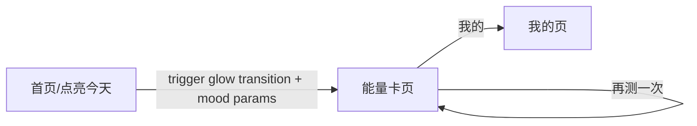

# 首页点亮到能量卡：光晕扩散过渡动画

## 目标效果

- 用户在首页选择“今日心情”后点击 `点亮今天`
- 屏幕出现与首页相同风格的光晕：向外扩散 -> 动画播放结束
- 随后切换到“今日能量卡页面”（卡片页标题显示所选心情：开心/平静/焦虑/疲惫）
- 如果已点亮（`hasCheckedIn=true`），保持当前策略：只 `showToast`，不再跳转

## 需要动的核心点（对应现状）

- 首页：`[pages/index/index.vue](./pages/index/index.vue)` 当前 `handleLightToday()` 只更新本地状态并 toast，没有跳转。
- 仓库里目前未发现能量卡页：`/pages/energy-card/index.vue`（需要新增）。
- 自定义底部导航仍保留在首页与其它页面；能量卡页按截图实现“分享/再测一次/我的”按钮栏，不复用 `custom-tabbar`。

## 实施步骤

### 1. 增加能量卡路由

- 更新 `[/Library/WebServer/web_www/yake/pages.json](pages.json)`
- 新增路由：`pages/energy-card/index`
- `style.navigationStyle` 设为 `custom`（使用自绘返回按钮）

### 2. 创建“今日能量卡页面”占位 UI（带本地映射）

- 新建：`[/Library/WebServer/web_www/yake/pages/energy-card/index.vue](pages/energy-card/index.vue)`
- 使用 Options API，与现有页面保持一致。
- `onLoad(options)`：读取查询参数
  - `mood`（key：sparkles/circle/cloud-alert/moon-star）
  - `moodLabel`（label：开心/平静/焦虑/疲惫）
- 顶部区域：
  - 左侧返回按钮：`uni.navigateBack()`
  - 小标题固定为 `今日关键词`
  - 大标题显示 `moodLabel`
- 主体区域：根据 `mood` 渲染两张圆角卡片（`今日建议` + `能量卡片`）
  - 文案先用本地映射/固定模板（后续再替换真实 AI 反馈）
- 底部按钮栏（对应第二张图）：
  - `分享`：toast 占位
  - `再测一次`：在同一 mood 下重新生成本地占位文案（可用随机/序号），并 toast
  - `我的`：`uni.navigateTo({ url: '/pages/profile/index' })`

### 3. 首页实现“光晕扩散遮罩”过渡 + 跳转

- 修改：`[/Library/WebServer/web_www/yake/pages/index/index.vue](pages/index/index.vue)`
- 新增状态：
  - `is-transitioning`（bool）用于控制遮罩是否显示
  - `transition-id`（数字或字符串）用于触发 CSS 动画重启
- 模板新增：
  - 仅在 `isTransitioning` 为 true 时展示一个固定层 `view.transition-overlay`
  - 内部放 `view.transition-glow`（径向渐变 + blur），通过 class/动画实现“向外扩散”
- 逻辑改造：
  - `handleLightToday()` 保持现有策略：
    - `hasCheckedIn=true`：toast “今天已经点亮过啦”，return
  - 当首次点亮成功后：
    - `this.hasCheckedIn = true`
    - `this.streakDays += 1`
    - 触发遮罩动画：`this.isTransitioning = true` 并更新 `transition-id`
    - 动画持续时间建议：`650ms`
    - 使用 `setTimeout` 等待动画结束再：
      - 从 `moodOptions` 找到当前 `selectedMood` 对应的 `moodLabel`
      - `uni.navigateTo({ url: '/pages/energy-card/index?mood=...&moodLabel=...' })`
- 交互保护：动画期间按钮点击应被遮罩层拦截（遮罩覆盖全屏即可）

### 4. 自测与 lints

- 手动验证：
  - 不选心情/默认心情 -> 标题正确显示
  - 首次点击点亮 -> 光晕扩散后进入能量卡页
  - 再次点击 -> toast 提示，且不会跳转/不会触发动画
  - 返回箭头 -> 回到首页并仍能看到自定义 tabbar
  - “再测一次” -> 占位文案刷新
- 运行 lints 检查本次改动文件

## 数据流（简图）

